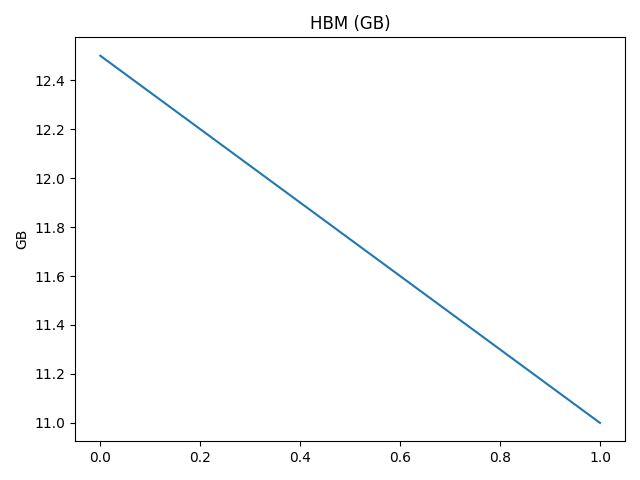
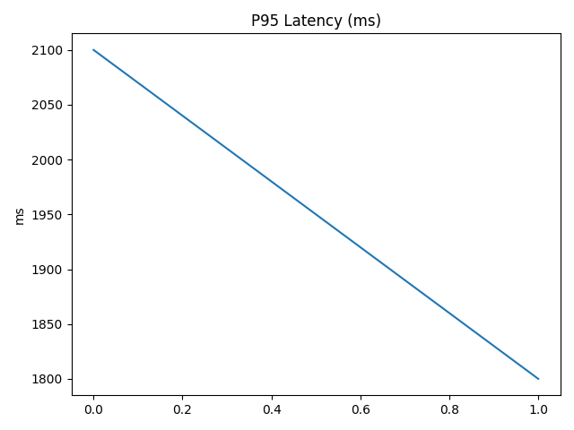
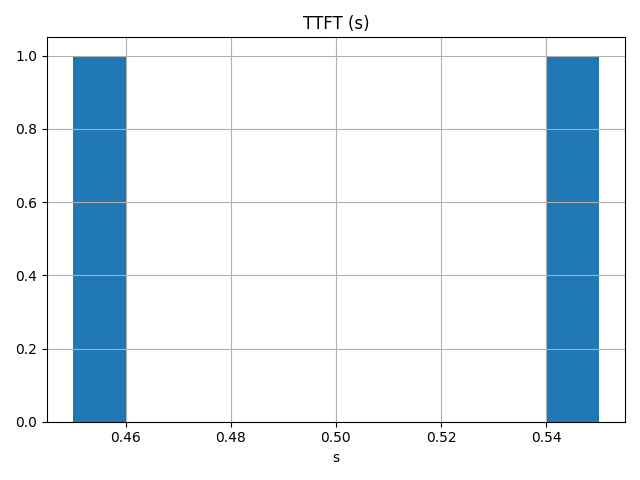
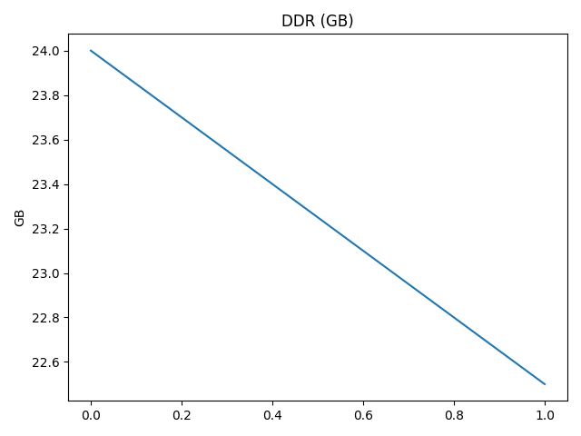

# KV-OptKit Run Report
## Summary
HBM before: 12.50 GB → after: 11.00 GB
DDR before: 24.00 GB → after: 22.50 GB
P95 latency: 2100.0 ms → 1800.0 ms
TTFT: 0.55 s → 0.45 s

## Go/No-Go
Result: PASS (threshold: P95 ≤ 2000 ms)

## Action Counters (Δ over window)
| Metric | Delta |
|---|---:|
| Tokens Evicted | 50 |
| Tokens Quantized | 30 |
| Reuse Hits | 300 |
| Reuse Misses | 50 |
| Autopilot Applies | 8 |
| Autopilot Rollbacks | 1 |

## Charts

